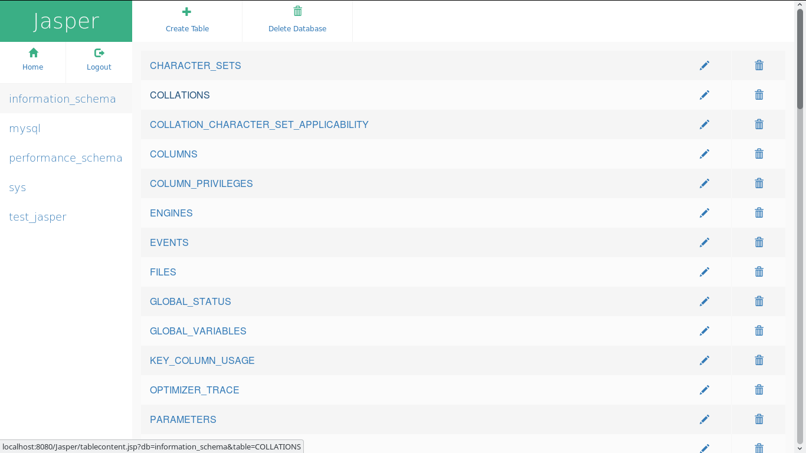
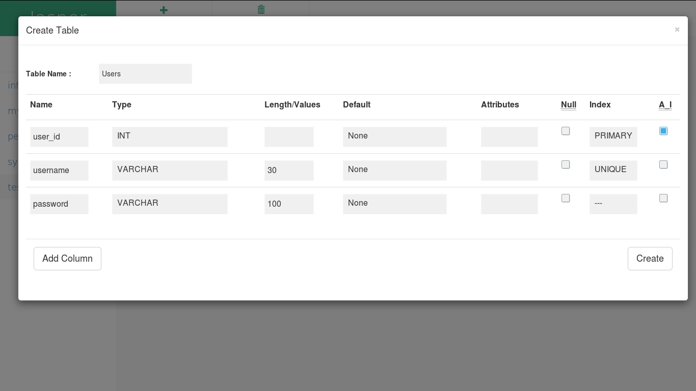
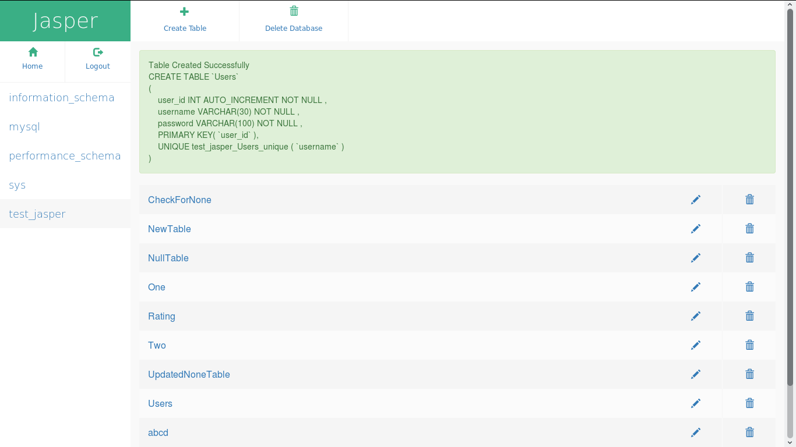
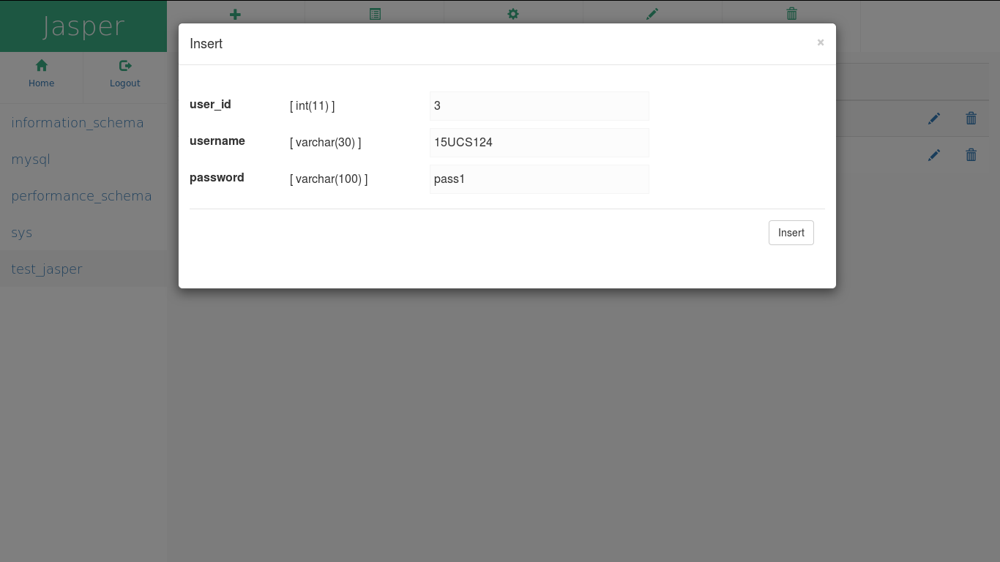

# Jasper

GUI Web App for MySQL to perform operations like _Create / Drop Database, Show Database Content, Create / Drop Table, Show Table Content, Insert / Delete / Update Values in Table_ via user interface.

### Installing

* Download and Setup Apache Tomcat

```
$ wget http://mirror.fibergrid.in/apache/tomcat/tomcat-8/v8.5.14/bin/apache-tomcat-8.5.14.tar.gz -O ~/
$ tar -xzf ~/apache-tomcat-8.5.14.tar.gz -C ~/
$ mv ~/apache-tomcat-8.5.14/ ~/Tomcat
```

* Download MySQL Connector Java and move the jar file to Tomcat/lib/ directory

```
$ wget https://dev.mysql.com/get/Downloads/Connector-J/mysql-connector-java-5.1.42.tar.gz -O ~/
$ tar -xzf ~/mysql-connector-java-5.1.42.tar.gz -C ~/
$ mv ~/mysql-connector-java-5.1.42/mysql-connector-java-5.1.42-bin.jar ~/Tomcat/lib/mysql-connector-java-5.1.42-bin.jar
```

* Download Jasper

```
$ cd ~/Tomcat/webapps/
$ git clone https://github.com/shashwatdixit124/Jasper.git
```

* Setup Java CLASSPATH

    add folowing code to ~/.bashrc file

```
export CLASSPATH=~/Tomcat/lib/servlet-api.jar
export CLASSPATH=~/Tomcat/lib/jsp-api.jar:$CLASSPATH
export CLASSPATH=~/Tomcat/lib/mysql-connector-java-5.1.41-bin.jar:$CLASSPATH
```

* Build Jasper

```
$ source ~/.bashrc
$ cd ~/Tomcat/webapps/Jasper
$ ./setup.sh
```

* Run Tomcat

```
$ cd ~/Tomcat/bin
$ ./startup.sh
```

* Goto http://localhost:8080/Jasper

### Working

* _Login With MySQL username and password._


* _Select Database listed on Left Panel and it shows the tables in that Database._



* _You Can Create a Table by clicking `Create table` in Action Bar on the Top._



* _You Get a Notigication if action was Sucessfull._



* _Select the Table to list the contents._


* _Insert Values in the table by clicking `Insert` in Action Bar on the Top._




See [Contributing.md](Contributing.md) for Jasper's Helper Functions.
